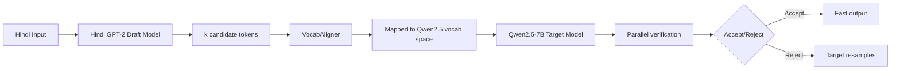

# Indic Speculative Decoding ⚡
### Quantifying the Vocabulary Mismatch Problem in Cross-Lingual LLM Inference

> Standard speculative decoding assumes draft and target models share 
> vocabulary space. For Indic languages, they don't — and nobody has 
> measured the cost of that gap. This project does.

[](https://python.org)
[](https://pytorch.org)
[](https://huggingface.co)
[](LICENSE)

**[→ Model on HuggingFace](YOUR_HF_LINK)** · 
**[→ Paper — in progress](YOUR_ARXIV_LINK)**

---

## The Core Finding

| Model | Tokenizer Fertility | Vocab Size |
|-------|-------------------|------------|
| Hindi GPT-2 (ours) | **1.31** | 8,192 |
| mBERT | 2.02 | 119,547 |
| Qwen2.5 | 4.65 | 152,064 |

**Fertility** = average tokens per Hindi word. Lower is better —
it means the tokenizer understands Hindi natively rather than
breaking words into subword fragments.

The 3x fertility gap between our Hindi GPT-2 (1.31) and Qwen2.5 (4.65)
means they tokenize the same Hindi sentence into fundamentally different
token sequences. In speculative decoding, the draft model proposes tokens
that the target model must verify — but if their vocabularies don't align,
draft proposals are systematically rejected even when semantically correct.

**This is the VocabMismatch problem.**

---

## What's Built

### Hindi GPT-2 Draft Model
- 13.9M parameters
- Custom 8K BPE tokenizer trained on Hindi corpus
- Fertility: 1.31 tokens/word (vs mBERT 2.02, Qwen2.5 4.65)
- Perplexity: 29.22 @ 20K training steps
- Small config trained to convergence

### VocabAligner
Bridges the 8K Hindi vocabulary to Qwen2.5's 152K vocabulary for
cross-lingual speculative decoding. Maps draft token distributions
to target token space for acceptance probability computation.

### Speculative Decoding Pipeline
Full SD implementation from scratch:
- Draft model generates k candidate tokens
- Target model verifies in parallel
- Acceptance/rejection based on probability ratio
- No frameworks — raw PyTorch implementation

---

## Architecture



---

## Experiments

### Experiment A — Cross-Vocab SD (Primary)
**Setup:** Hindi GPT-2 (8K vocab) → Qwen2.5-7B (152K vocab)  
**Hypothesis:** Vocabulary mismatch causes systematic acceptance 
rate penalty beyond what model quality alone explains  
**Status:** 🔄 Running on Kaggle (P100)  
**What we expect to measure:** Acceptance rate α, tokens/second speedup,
quality degradation vs baseline

### Experiment B — Shared-Vocab Baseline
**Setup:** Qwen2.5-0.5B (152K vocab) → Qwen2.5-7B (152K vocab)  
**Hypothesis:** Shared vocabulary eliminates the mismatch penalty,
establishing the upper bound for cross-lingual SD  
**Status:** 🔄 Running on Kaggle (P100)  
**What we expect to measure:** Acceptance rate α upper bound,
theoretical speedup ceiling for Hindi SD

### Results Table (filling after experiments)
| Setup | Acceptance Rate α | Tokens/sec | Speedup vs Baseline |
|-------|------------------|------------|-------------------|
| Experiment B — Shared vocab | — | — | — |
| Experiment A — Cross vocab | — | — | — |
| Vocabulary mismatch cost | — | — | — |

---

## Why This Matters

Speculative decoding is one of the most practical inference optimization
techniques for production LLM deployment. Every major lab uses it.
But all existing benchmarks assume English or shared-vocabulary setups.

For Indic language deployment — where you want a small, fast Hindi draft
model to accelerate a large multilingual target — the vocabulary mismatch
is unavoidable. Nobody has quantified this cost.

This project quantifies it. That number — the acceptance rate penalty
from vocabulary mismatch — is the contribution.

---

## Research Connection

This work is the basis for:

**VocabMismatch: Quantifying the Cost of Cross-Lingual Speculative
Decoding for Indic Languages**

Manuscript in preparation. arXiv submission targeted after
experiment completion.

`[arXiv link — coming soon]`

---

## Training Details
Model:          Hindi GPT-2 (custom architecture)
Parameters:     13.9M
Tokenizer:      Custom BPE, 8K vocabulary
Training data:  Hindi Wikipedia + CC-100 Hindi subset
Steps:          20,000 (small config)
Perplexity:     29.22
Hardware:       Kaggle P100 GPU
Framework:      PyTorch (no HuggingFace Trainer)

---

## Known Limitations

- Small config only — medium config dropped due to compute constraints
- Experiments pending — acceptance rate numbers not yet measured
- VocabAligner approximates token mapping — not a perfect alignment
- Hindi corpus limited to Wikipedia + CC-100 — domain coverage narrow
- No comparison against other Indic draft models

---

## Setup

```bash
git clone https://github.com/asheesh07/indix-speculative-decoding
cd indix-speculative-decoding
pip install -r requirements.txt

# Train Hindi GPT-2
python train.py --config configs/small.yaml

# Run speculative decoding experiment
python speculative_decoding.py \
  --draft_model hindi_gpt2 \
  --target_model Qwen/Qwen2.5-7B \
  --experiment cross_vocab
```

---

## File Structure

```
indix-speculative-decoding/
├── train.py                    # Hindi GPT-2 training loop
├── speculative_decoding.py     # Core SD implementation
├── dataset.py                  # Hindi corpus data pipeline
├── config.py                   # Model and training configs
├── collect_data.py             # Data collection scripts
├── vocab_aligner.py            # VocabAligner implementation
├── configs/
│   └── small.yaml              # Small config (trained)
└── notebooks/
    └── kaggle_experiments.ipynb  # Kaggle experiment notebook
```
---

## Future Work

- [ ] Complete Experiment A and B — measure actual α values
- [ ] Submit VocabMismatch paper to arXiv
- [ ] Upload Hindi GPT-2 weights to HuggingFace
- [ ] Medium config training (pending compute)
- [ ] Extend to other Indic languages — Telugu, Tamil, Bengali
- [ ] Compare against IndicBERT and MuRIL as draft models

---

## License

MIT — see [LICENSE](LICENSE)
