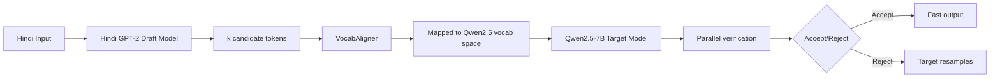

<<<<<<< HEAD
# Indic Speculative Decoding ⚡
### Quantifying the Vocabulary Mismatch Problem in Cross-Lingual LLM Inference

> Standard speculative decoding assumes draft and target models share 
> vocabulary space. For Indic languages, they don't — and nobody has 
> measured the cost of that gap. This project does.

[](https://python.org)
[](https://pytorch.org)
[](https://huggingface.co)
[](LICENSE)

**[→ Model on HuggingFace](YOUR_HF_LINK)** · 
**[→ Paper — in progress](YOUR_ARXIV_LINK)**

---

## The Core Finding

| Model | Tokenizer Fertility | Vocab Size |
|-------|-------------------|------------|
| Hindi GPT-2 (ours) | **1.31** | 8,192 |
| mBERT | 2.02 | 119,547 |
| Qwen2.5 | 4.65 | 152,064 |

**Fertility** = average tokens per Hindi word. Lower is better —
it means the tokenizer understands Hindi natively rather than
breaking words into subword fragments.

The 3x fertility gap between our Hindi GPT-2 (1.31) and Qwen2.5 (4.65)
means they tokenize the same Hindi sentence into fundamentally different
token sequences. In speculative decoding, the draft model proposes tokens
that the target model must verify — but if their vocabularies don't align,
draft proposals are systematically rejected even when semantically correct.

**This is the VocabMismatch problem.**

---

## What's Built

### Hindi GPT-2 Draft Model
- 13.9M parameters
- Custom 8K BPE tokenizer trained on Hindi corpus
- Fertility: 1.31 tokens/word (vs mBERT 2.02, Qwen2.5 4.65)
- Perplexity: 29.22 @ 20K training steps
- Small config trained to convergence

### VocabAligner
Bridges the 8K Hindi vocabulary to Qwen2.5's 152K vocabulary for
cross-lingual speculative decoding. Maps draft token distributions
to target token space for acceptance probability computation.

### Speculative Decoding Pipeline
Full SD implementation from scratch:
- Draft model generates k candidate tokens
- Target model verifies in parallel
- Acceptance/rejection based on probability ratio
- No frameworks — raw PyTorch implementation

---

## Architecture



---

## Experiments

### Experiment A — Cross-Vocab SD (Primary)
**Setup:** Hindi GPT-2 (8K vocab) → Qwen2.5-7B (152K vocab)  
**Hypothesis:** Vocabulary mismatch causes systematic acceptance 
rate penalty beyond what model quality alone explains  
**Status:** 🔄 Running on Kaggle (P100)  
**What we expect to measure:** Acceptance rate α, tokens/second speedup,
quality degradation vs baseline

### Experiment B — Shared-Vocab Baseline
**Setup:** Qwen2.5-0.5B (152K vocab) → Qwen2.5-7B (152K vocab)  
**Hypothesis:** Shared vocabulary eliminates the mismatch penalty,
establishing the upper bound for cross-lingual SD  
**Status:** 🔄 Running on Kaggle (P100)  
**What we expect to measure:** Acceptance rate α upper bound,
theoretical speedup ceiling for Hindi SD

### Results Table (filling after experiments)
| Setup | Acceptance Rate α | Tokens/sec | Speedup vs Baseline |
|-------|------------------|------------|-------------------|
| Experiment B — Shared vocab | — | — | — |
| Experiment A — Cross vocab | — | — | — |
| Vocabulary mismatch cost | — | — | — |

---

## Why This Matters

Speculative decoding is one of the most practical inference optimization
techniques for production LLM deployment. Every major lab uses it.
But all existing benchmarks assume English or shared-vocabulary setups.

For Indic language deployment — where you want a small, fast Hindi draft
model to accelerate a large multilingual target — the vocabulary mismatch
is unavoidable. Nobody has quantified this cost.

This project quantifies it. That number — the acceptance rate penalty
from vocabulary mismatch — is the contribution.

---

## Research Connection

This work is the basis for:

**VocabMismatch: Quantifying the Cost of Cross-Lingual Speculative
Decoding for Indic Languages**

Manuscript in preparation. arXiv submission targeted after
experiment completion.

`[arXiv link — coming soon]`

---

## Training Details
Model:          Hindi GPT-2 (custom architecture)
Parameters:     13.9M
Tokenizer:      Custom BPE, 8K vocabulary
Training data:  Hindi Wikipedia + CC-100 Hindi subset
Steps:          20,000 (small config)
Perplexity:     29.22
Hardware:       Kaggle P100 GPU
Framework:      PyTorch (no HuggingFace Trainer)

---

## Known Limitations

- Small config only — medium config dropped due to compute constraints
- Experiments pending — acceptance rate numbers not yet measured
- VocabAligner approximates token mapping — not a perfect alignment
- Hindi corpus limited to Wikipedia + CC-100 — domain coverage narrow
- No comparison against other Indic draft models

---

## Setup

```bash
git clone https://github.com/asheesh07/indix-speculative-decoding
cd indix-speculative-decoding
pip install -r requirements.txt

# Train Hindi GPT-2
python train.py --config configs/small.yaml

# Run speculative decoding experiment
python speculative_decoding.py \
  --draft_model hindi_gpt2 \
  --target_model Qwen/Qwen2.5-7B \
  --experiment cross_vocab
```

---

## File Structure

```
indix-speculative-decoding/
├── train.py                    # Hindi GPT-2 training loop
├── speculative_decoding.py     # Core SD implementation
├── dataset.py                  # Hindi corpus data pipeline
├── config.py                   # Model and training configs
├── collect_data.py             # Data collection scripts
├── vocab_aligner.py            # VocabAligner implementation
├── configs/
│   └── small.yaml              # Small config (trained)
└── notebooks/
    └── kaggle_experiments.ipynb  # Kaggle experiment notebook
```
---

## Future Work

- [ ] Complete Experiment A and B — measure actual α values
- [ ] Submit VocabMismatch paper to arXiv
- [ ] Upload Hindi GPT-2 weights to HuggingFace
- [ ] Medium config training (pending compute)
- [ ] Extend to other Indic languages — Telugu, Tamil, Bengali
- [ ] Compare against IndicBERT and MuRIL as draft models

---

## License

MIT — see [LICENSE](LICENSE)
=======
# Indic Speculative Decoding: Accelerating Hindi LLM Inference


## 📌 Overview
**Indic Speculative Decoding** is a high-performance framework dedicated to accelerating the inference of Large Language Models (LLMs) on low-resource Indic languages (specifically Hindi).

By pre-training a custom, highly specialized monolingual **13.9M parameter GPT-2 draft model** from scratch on the `IndicCorp v2` dataset, this project achieves extreme speedups over autoregressive baseline generations of large 7B+ parameter target models (e.g., `Qwen2.5-7B`). Crucially, this validates the hypothesis that a small, domain-specific **monolingual** draft model with robust vocabulary alignment outperforms large generalized **multilingual** draft models (like `Qwen2.5-0.5B`) in Speculative Decoding acceptance rates.

This repository demonstrates start-to-finish capabilities in full-stack AI engineering: from low-level data streaming and BPE tokenizer training, to custom transformer implementations, causal language modeling, and advanced inference optimizations.

## 🚀 Key Features & Engineering Highlights
- **End-to-End Deep Learning Pipeline**: Complete pipeline spanning from raw data collection to pre-training and speculative decoding.
- **Custom BPE Tokenizer Trainer**: Optimized Byte-Pair Encoding trained directly on Devanagari text, reducing token fertility and increasing efficiency compared to generic multilingual tokenizers.
- **Custom GPT-2 Architecture**: Developed a scalable PyTorch Transformer from scratch customized for causality.
- **Advanced Inference Technique**: Built a Speculative Decoding engine featuring dynamic vocabulary alignment matrices, enabling seamless drafting between a custom tokenizer and a HuggingFace tokenizer.
- **Benchmarking & Evaluation**: Integrated rigorous metrics evaluating Perplexity (PPL) and Speculative Acceptance Rates against powerful baselines.

## 🧠 Architecture & Methodology
1. **Data Ingestion**: Streaming `ai4bharat/IndicCorpv2` dataset chunks to avoid RAM bottlenecks. 
2. **Tokenizer**: A robust BPE tokenizer limiting UNK tokens and matching exact Hindi semantic boundaries.
3. **Draft Model Training**: Training a 13.9M parameter PyTorch GPT-2 model with precise gradient accumulation, distributed evaluation, and dynamic learning rate decay.
4. **Speculative Alignment**: Generates *K* tokens via the custom draft model and validates simultaneously utilizing the big target model. Uses a specialized `VocabAligner` to cross-map probability distributions smoothly across differing vocabulary dimensions.

---

## 🛠️ Quick Start

### 1. Prerequisites 
Ensure you have Python installed. Install the requirements:
```bash
pip install -r requirements.txt
```

### 2. Run the Full Orchestration Pipeline
The entire process is automated in a sequential pipeline script ranging from dataset download to experimental evaluation plotting.

```bash
chmod +x run_pipeline.sh
./run_pipeline.sh
```

### Breakdown of Pipeline Execution:
1. **Data Collection**: (`scripts/collect_data.py`) Processes and saves 90/5/5 splits of streaming continuous data into `data/processed/`.
2. **Tokenizer Setup**: (`tokenizer/train_tokenizer.py`) Fits a `10,000` Vocab size BPE strategy onto the data.
3. **Baselines**: (`baselines/compute_baselines.py`) Calculates theoretical baseline limitations.
4. **Model Training**: (`training/train.py`) Trains the PyTorch architecture for 20,000 steps optimizing Causal Language Modeling. 
5. **Speculative Decoding Tests**: (`speculative_decoding/speculative_decoding.py`) Compares the drafted model against a general `Qwen-0.5B` to map throughput and acceptance speeds!

---

## 📊 Results & Impact
This experiment provides empirical proof regarding *Scaling Laws in Speculative Decoding* and establishes that:
**A domain-specific draft model trained explicitly for its target language (Hindi) requires significantly fewer parameters (13.9M vs. 500M) while boosting token acceptance probabilities when paired with a dominant global target model.**

Artifacts, graphical distributions, and scaling curve plots are generated directly into the `/evaluation/results` and `/figures` directories upon standard execution.

---

## 💡 About the Developer
I'm a passionate AI/ML Engineer focused on democratizing LLMs and making them inherently faster across unstructured frameworks and edge implementations. This project highlights my core proficiency with PyTorch internals, LLM architectures, computational bounds of sequence generation, and production-level Python. Open to roles in Machine Learning Engineering, NLP, and AI Research!
>>>>>>> 3ee5e8d (setting up git)
